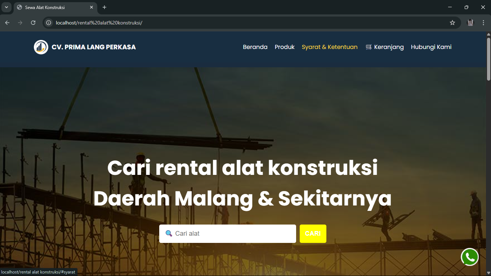

# 🏗️ Rental Alat Konstruksi

Website sederhana untuk pengelolaan penyewaan alat konstruksi.

## 📂 Teknologi yang Digunakan
- HTML, CSS, JavaScript
- PHP (tanpa framework)
- XAMPP / Laragon (untuk menjalankan server lokal)

## 📸 Screenshot Tampilan
_Tambahkan file screenshot di folder `screenshots` dan tampilkan di sini:_
```markdown



🚀 Cara Menjalankan Proyek
Clone repository:

```bash
git clone https://github.com/kamilaaura/sewa-alat-konstruksi.git
```

### 2. Simpan folder ini di dalam direktori htdocs 
- `htdocs` jika menggunakan XAMPP

### 3.Jalankan server lokal:
- Jika pakai XAMPP buka `http://localhost/rental-alat.`
- Jika pakai Laragon buka domain sesuai auto virtual host `(misal: http://rental-alat.test).`

### ✨ Fitur
✅ Halaman utama daftar alat
✅ Form pemesanan penyewaan
✅ Responsive Design (tampilan mobile-friendly)

### 📁 Struktur Folder

rental-alat/
├── index.php
├── about.html
├── js/
├── css/
└── img/

### 🙋‍♀️ Author
Kamila Aurellia – GitHub

Proyek ini merupakan tugas akhir dari kegiatan magang saya, yang dibuat untuk menunjukkan kemampuan dasar saya dalam membangun website menggunakan PHP dan HTML secara mandiri.


